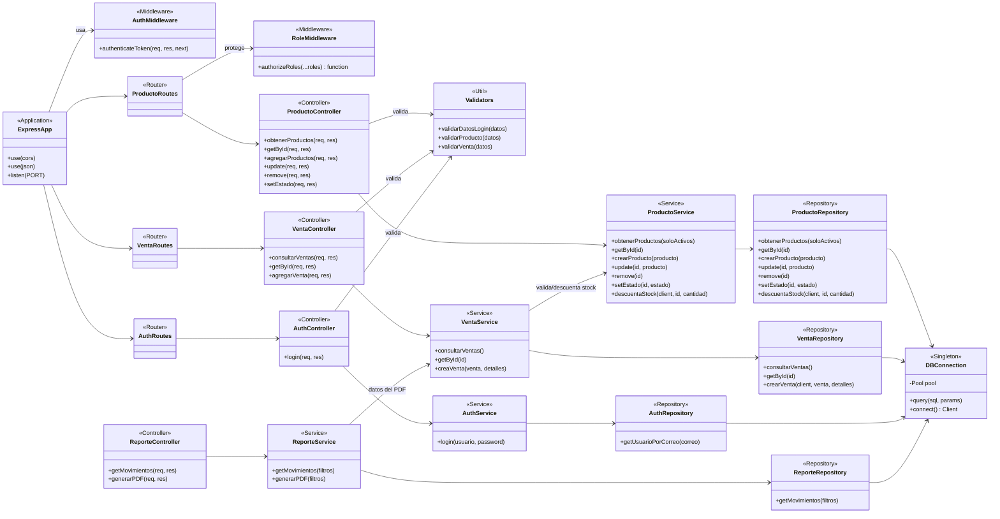
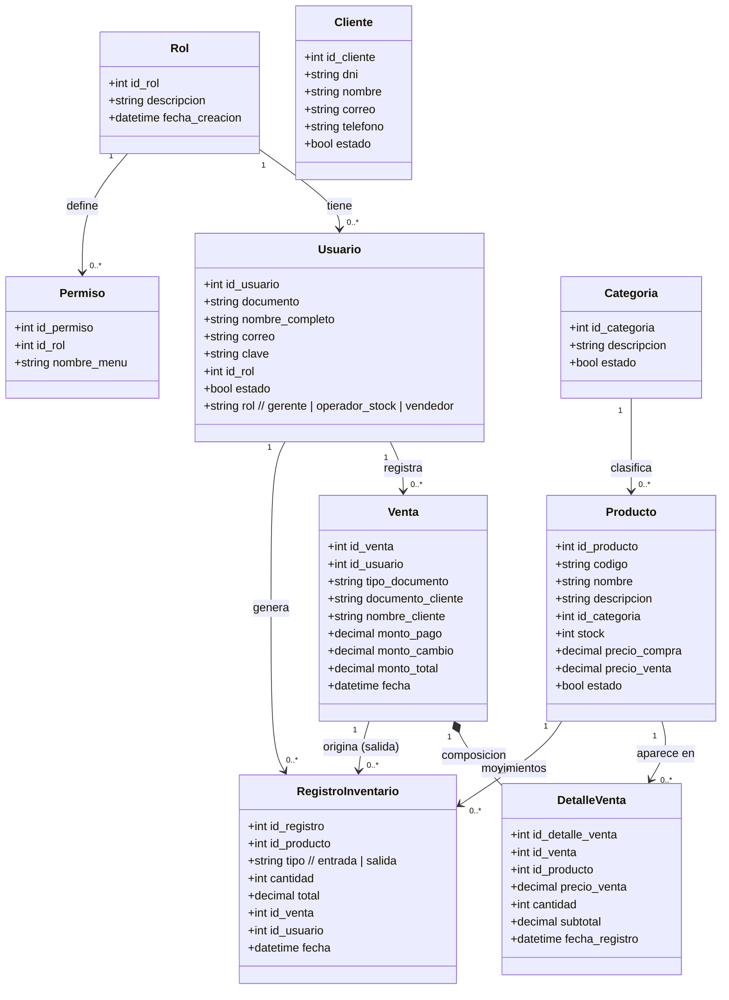

# ZenithWeb — Diagrama de Clases UML y Patrones de Diseño

Sistema de Gestión de Stock de Paneles Solares.
Stack: **Node.js/Express** (backend), **React** (frontend), **PostgreSQL** (driver `pg`).

> Nota: el backend está escrito con **módulos de funciones** (no clases JS literales).
> Para el modelado UML cada módulo se representa como una *clase de estereotipo*
> (`<<Controller>>`, `<<Service>>`, `<<Repository>>`, etc.), lo cual es la práctica
> habitual para documentar arquitecturas en capas tipo Node/Express.

---

## 1. Arquitectura en capas (visión general)

```
  Cliente (React)
        │  HTTP / JSON + JWT
        ▼
 ┌─────────────────────────────────────────────┐
 │  Express App (index.js)                       │
 │   ├─ Middleware: authenticateToken            │
 │   └─ Middleware: authorizeRoles(...)          │
 └─────────────────────────────────────────────┘
        │
        ▼
   [ Routes ] ──► [ Controllers ] ──► [ Services ] ──► [ Repositories ] ──► [ DB Pool ] ──► PostgreSQL
                       │
                       └──► [ Validators ] (utils)
```

Cada recurso del dominio (Producto, Venta, Movimiento, Reporte, Categoría, Auth)
repite la misma cadena Route → Controller → Service → Repository.

---

## 2. Diagrama de Clases — Capas de la Aplicación (Mermaid)



---

## 3. Diagrama de Clases — Modelo de Dominio / Entidades (Mermaid)

Derivado del esquema PostgreSQL (`backup.sql`, `crear_registro_inventario.sql`).



**Notas del modelo:**
- `Venta` ◆— `DetalleVenta`: **composición** (los detalles no existen sin su venta).
- El rol se duplica: existe la tabla `rol`/`id_rol` (modelo original) y la columna
  `usuario.rol` (string) que es la que realmente viaja en el JWT y controla los permisos.
- `Producto.remove()` es **baja lógica** (`estado=false`) para preservar el historial de ventas.

---

## 4. Patrones de Diseño identificados

| # | Patrón | Tipo | Dónde se aplica | Evidencia |
|---|--------|------|-----------------|-----------|
| 1 | **Arquitectura en Capas (N-Tier / Layered)** | Arquitectónico | Todo el backend | `routes/ → controllers/ → services/ → repositories/ → db/` |
| 2 | **Repository** | Estructural | `src/repositories/*` | Aíslan el SQL; el resto del sistema no conoce PostgreSQL |
| 3 | **Service Layer / Facade** | Estructural | `src/services/*` | Orquestan la lógica de negocio y exponen una API simple a los controllers |
| 4 | **Singleton** | Creacional | `src/db/connection.js` | Un único `Pool` compartido vía `module.exports` (cache de módulos de Node) |
| 5 | **Chain of Responsibility (Middleware)** | Comportamiento | `index.js`, `*Routes.js` | `authenticateToken → authorizeRoles → controller` (cada uno decide pasar o cortar con `next()`) |
| 6 | **MVC** (variante) | Arquitectónico | Controllers + Models(DB) + Vistas(React) | Separación responsabilidad request/negocio/datos |
| 7 | **Transaction Script** | Comportamiento | `ventaService.creaVenta()` | `BEGIN/COMMIT/ROLLBACK` con `client` para venta atómica |
| 8 | **Dependency Injection** (manual) | Creacional | `descuentaStock(client, ...)`, `crearVenta(client, ...)` | Se inyecta el `client` de la transacción a los repositorios |
| 9 | **DTO / Strategy de validación** | Comportamiento | `utils/validators.js` | Funciones de validación desacopladas e intercambiables por recurso |
| 10 | **Module Pattern** | Creacional | Todo el código JS | Encapsulamiento vía `exports.*` (estado/funciones privadas por módulo) |

### Patrón estrella: **Repository + Service Layer**

El núcleo del diseño es la separación en tres responsabilidades por recurso:

```
Controller  →  traduce HTTP (req/res, status codes, validación de entrada)
Service     →  reglas de negocio + transacciones (qué hacer)
Repository  →  acceso a datos / SQL puro (cómo persistir)
```

Esto permite, por ejemplo, que `VentaService.creaVenta()` coordine *varios*
repositorios (`ventaRepository` + `productoService.descuentaStock`) dentro de una
sola transacción, sin que el controller ni la base de datos se acoplen entre sí.

### Patrón de seguridad: **Middleware Chain**

```
Request ──► authenticateToken ──► authorizeRoles('gerente','operador_stock') ──► Controller
              (¿token válido?)        (¿rol permitido?)                          (lógica)
```

`authenticateToken` extrae y verifica el JWT (poblando `req.user`); `authorizeRoles`
es una **factory** que retorna un middleware parametrizado con los roles permitidos
(closure sobre `...roles`) — combinando *Chain of Responsibility* con *Factory Method*.

---

## 5. Resumen para defensa / informe

- **Estilo arquitectónico principal:** Arquitectura en Capas (Layered) sobre Express.
- **Patrón GoF más representativo:** Singleton (pool de conexión) + uso intensivo de
  Repository y Facade (no-GoF pero patrones de Fowler/PoEAA).
- **Atomicidad:** las ventas usan Transaction Script con rollback ante stock insuficiente.
- **Seguridad:** Middleware Chain (JWT + RBAC con 3 roles: gerente, operador_stock, vendedor).
```